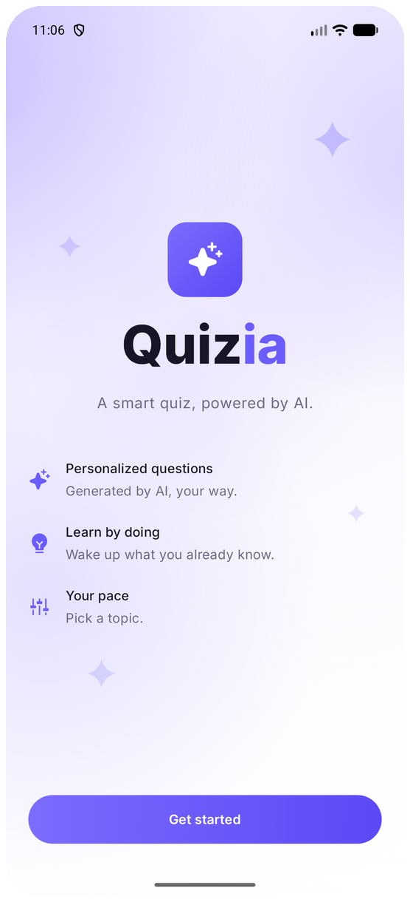
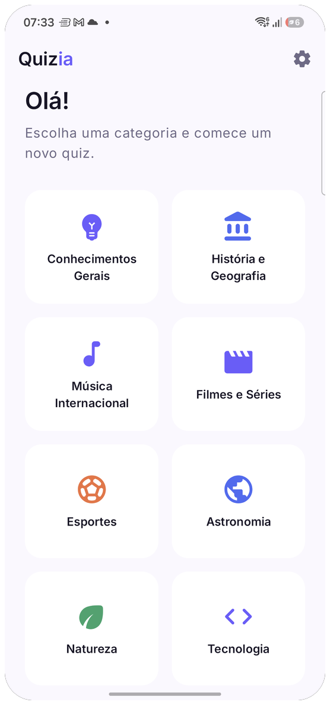
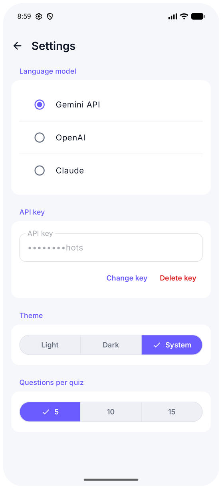
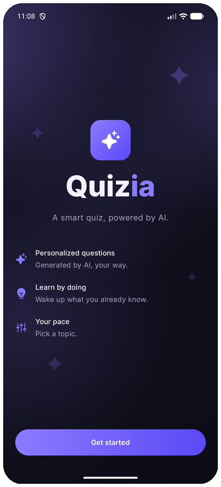
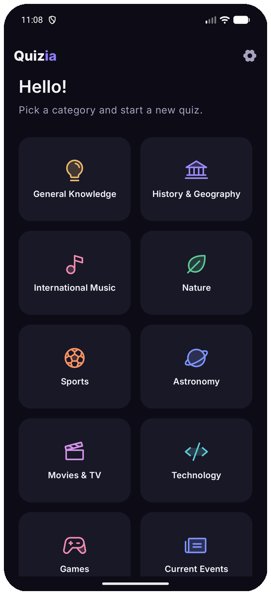
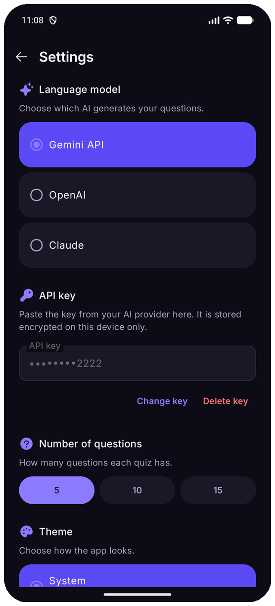

# Quizia

[](https://github.com/vitorfg8/quizia/actions/workflows/quality.yml)
[](https://github.com/vitorfg8/quizia/actions/workflows/semgrep.yml)

An AI-powered quiz app for Android. Questions are generated on demand by a large language model of your choice. The app follows a **Bring Your Own Key (BYOK)** model: you provide your own API key for cloud providers. On-device inference via Gemini Nano requires no key when supported by the device.

## Screenshots

<p align="center">
  
  
  
</p>

<p align="center">
  <sub>Light — Welcome · Home · Settings</sub>
</p>

<p align="center">
  
  
  
</p>

<p align="center">
  <sub>Dark — Welcome · Home · Settings</sub>
</p>

## Features

- Choose a topic (General Knowledge, History & Geography, International Music, Movies & TV, Sports, Astronomy, Nature, Technology, Games, Current Events)
- Questions generated live by the selected LLM — no pre-built question bank
- Results screen with score, time and a play-another shortcut
- Light and dark theme support
- English and Brazilian Portuguese (locale-driven)

## Supported LLM providers

| Provider | Requires key | How to get one |
|---|---|---|
| Gemini Nano (on-device) | No | Available automatically on supported devices (API 26+) |
| Gemini API | Yes | [aistudio.google.com/apikey](https://aistudio.google.com/apikey) — free tier, no credit card required |
| OpenAI | Yes | [platform.openai.com/api-keys](https://platform.openai.com/api-keys) — pay-as-you-go |
| Claude | Yes | [console.anthropic.com](https://console.anthropic.com) — ~$5 trial credit for new accounts |

API keys are stored locally in **EncryptedSharedPreferences** and never logged or sent anywhere other than the provider's own API endpoint.

## Requirements

- Android 8.0 (API 26) or higher
- An API key for the provider you want to use (except Gemini Nano)

## Tech stack

| Layer | Library |
|---|---|
| Language | Kotlin 2.4.20 |
| UI | Jetpack Compose + Material3 |
| DI | Koin 4.2.2 |
| Navigation | Navigation Compose 2.10.1 |
| HTTP | Retrofit 3.0.0 + OkHttp 5.5.0 + Gson 2.14.0 |
| On-device LLM | ML Kit GenAI Prompt API 1.0.0-beta4 |
| Preferences | DataStore Preferences 1.2.1 |
| Secure storage | EncryptedSharedPreferences (security-crypto 1.1.0-alpha06) |

## Module graph

```
:app
 ├── :designsystem
 ├── :feature:welcome
 ├── :feature:llmsetup
 ├── :feature:home
 ├── :feature:quiz
 ├── :feature:results
 └── :core:domain
      ├── :core:data
      └── :core:llm
```

## Building

```bash
# Clone
git clone <repo-url>
cd quizia

# Debug build
./gradlew assembleDebug

# Run unit tests
./gradlew testDebugUnitTest

# Static analysis
./gradlew detekt

# Coverage report (min 80% branch coverage enforced)
./gradlew koverVerify
```

## Version

**0.5.1** — pre-release; breaking changes may occur between minor versions.
